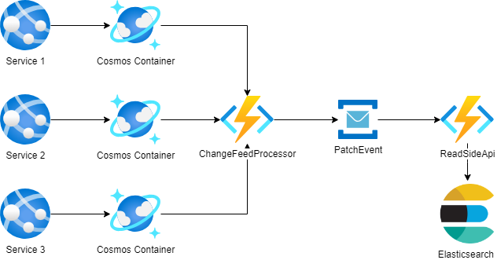
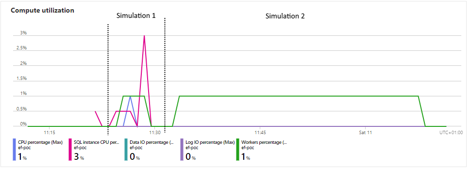

## This repository represents a few examples of edge cases encountered when using Entity Framework for the read side, blindly following DDD patterns.

Let's begin with a brief introduction to the problem.

A long time ago, there was a project where the read side was implemented with Elasticsearch.

However, the presentation of data was very problematic because you can't bind data from multiple collections in one request. 
So, as a lightweight solution, new fields was added to domain models to allow for a more comprehensive presentation. This was necessary because the document on the read side was a clone of the structure on the write side.

Finally, a decision to change to standard storage was made, and SQL was chosen. 

Finally, a decision to change to standard storage was made, and SQL was chosen. Unfortunately, the team, which hadn't worked with SQL for too long, especially with raw SQL, began changing all repositories without any changes to the structure. 

The consequences are described in this repository

### Setup
Please set an EFExampleConnectionString environment variable with a connection string to your database.
```PowerShell
$env:EFExampleConnectionString = 'Data Source=localhost;Initial Catalog=EFExample;Integrated Security=True;MultipleActiveResultSets=True;TrustServerCertificate=True'
```

Choose one of the projects (EF6, EF7, EF8) as a startup project and call ``Update-Database``, then run it.
(each project contains its own schema, so you have to update the database for each project)


### Examples include
1. Four projects, each for EF6, EF7, EF8 where EF6 and EF7 are almost the same, and EF8 contains an attempt to use ComplexType [But collections are not available still], And one EF6SimpleId model where there is another construction of a primary key (on one column).
1. Each project contains the same model but is set up to a different schema.
1. As the main model, Person, where we will name a Fat person as an entity with a lot of properties and relations, and Thin for a simple entity.
1. Almost all examples in ExampleServices take 3 parameters of DbContext to represent different scopes like separated calls to the API.


## Example 1 Load a Fat person on local and azure
At first, I recommend checking how the Person model looks. Unfortunately, there are **12** ``OwnsMany``  relations. 
Using OwnsMany is a consequence of blindly following DDD patterns because it represents the ideal definition for ValueObjects. 
This allows us to have stored ValueObjects where this type of entity (because it is still an entity type for EF with a table, of course) is managed only by the AggregateRoot, and it will always be included when you call for an entity. So, "Amazing"? No, not in this case, especially when we are on the read side.

For Thin person, it is not a problem, but for Fat person, it is a problem. 
When SQL has to return a Fat person, it has to join 12 tables, and it is a lot of work for the SQL server. 
Additionally, there is a significant amount of data to transfer from the SQL server to our application.

| RelationName             | Simulation 1    | Simulation 2    | Simulation 3 | Simulation 4 |
| ------------------------ | --------------- | --------------- | ------------ | ------------ |
| MedicalConditions        | 3               | 4               | 9            | 9            |
| DistinguishingFeatures   | 3               | 5               | 7            | 7            |
| PhoneNumbers             | 3               | 6               | 8            | 8            |
| Vehicles                 | 2               | 2               | 6            | 6            |
| EmergencyContacts        | 2               | 2               | 8            | 8            |
| RiskProfile              | 2               | 2               | 9            | 9            |
| Roles                    | 2               | 2               | 2            | 2            |
| Ancestors                | 2               | 2               | 4            | 4            |
| Descendants              | 2               | 2               | 6            | 6            |
| Trackers                 | 2               | 2               | 8            | 8            |
| AssignedSubscriptions    | 2               | 2               | 3            | 3            |
| Tags                     | 1               | 3               | 1            | 2            |
| ------------------------ | --------------- | --------------- | ------------ | ------------ |
| SQL Rows Required        | 6 912           | 92 160          | 250 822 656  | 501 645 312  |
| Time Local SQL -> EF     | 0:00:00,8506196 | <span style="color: orange">0:00:11,2954777</span> | 8:32:00,000* | 16:04:00,000* |
| Time Azure SQL -> EF     | <span style="color: red">0:02:34,5403125 </span>| <span style="color: red">0:34:49,1078136</span> | Fa** IT      | Fa** IT      |

\* Estimated  base on Simulation 2

... a half an hour to load a person from Azure SQL. ...

In the summary, we observe the number of rows required to represent one Fat person, the time required to load a person in this example from SQL on a local machine (32 GB RAM, Intel i7-11850H), and in the next row, from Azure SQL (GP_S_Gen5_2). 
You might argue that Azure SQL is set up to be more efficient, but there was a similar behavior with a 50 DTU database.

Here is a screenshot of Azure Compute utilization during Simulation 1 and 2.



What is sad is that **90%** of getting a person in the application is usually to **check roles, tags, or just get a name**. 
Only one endpoint returns all data. However, in the case of using OwnsMany instead of a traditional HasMany (where we have to use include), we have to load all data.
But in case we use OwnsMany instead a traditional HasMany(where we have to use include) we have to load all data.

### What solutions did we use? Not just one:

1. Replace ValueObject with a standard HasMany.
We had another RoleEntity, so instead of duplicating this in the value object, it was moved to a common N-N relation between entities.
1. Store flexible ValueObject as JSON in an nvarchar column.	
MedicalConditions, DistinguishingFeatures, Vehicles, EmergencyContacts were objects that we only use in one endpoint, GetPersonById, so it was easier to just serialize.
1. Change the repository pattern to expose an IQueryable instead of an IEnumerable.
This allows us to use projection to get only the data we need, and it also reduces the amount of required joins.


## Example 2 
description soon